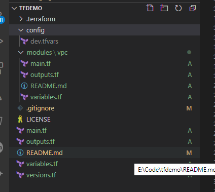

# tfdemo
# Terraform Demo Project
`This is only a demo terraform project to get you started. It uses teraform 0.12 with aws provider to crrete a VPC Makes use of modules, variables and outputs. Note how the variables and outputs pass from the root to the module folder.`

# To run in your system make the following changes
`For the versions please make changes to versions.tf`
`For the local configuration please add/change config/<env>.tfvars`
`For variables like name changes needed to variables.tf under root`

## To add new feature
`Add the module in the modules folder`
`Call the module from the root main.tf file`

## Directory Structure

## Pre-requisites
==============
1. Download Teraform from https://www.terraform.io/downloads.html
==============
2. Add Terraform to PATH
==============
3. git clone https://github.com/SurdTechnologies/tfdemo.git
==============
4. cd tfdemo
==============
5. Setup the backend to store the terraform state file
   `a. Create a S3 bucket where you would like to store your tfstate file`
   `b. Put in a dummy terraform.tfstate file in the above bucket`
   `c. Create a DynamoDB table with Primary partition key LockID (String)`
   `d. (Optional) Create a KMS key if you are to use one`
==============
6. Under tfdemo/config folder create a file named <env>.tfvars which contains the following 2 lines
   `profile = <profile-name>`
   `shared_credentials_file = <credential-file-path>`
==============
7. Initialize your terraform project with the command
   `terraform init -var-file=./config/<env>.tfvars`
==============
8. Dry run your code
   `terraform plan -var-file=./config/<env>.tfvars`
==============
9. Provision your environment
   `terraform apply -var-file=./config/<env>.tfvars`
==============
10. Destroy the environment
   `terraform destroy -var-file=./config/<env>.tfvars`