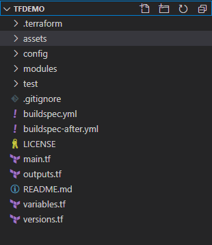

# https://www.hashicorp.com/blog/announcing-hashicorp-terraform-0-13/
## Terraform Demo Project
#### This is only a demo terraform project to get you started. 
#### It uses teraform 0.13 with aws provider to create a VPC & EIP.
#### Makes use of modules, variables and outputs.
#### Note how the variables and outputs pass from the root to the module folder.
#### It makes use of count with modules, a new feature of terraform 0.13

## To run make the following changes
#### For the versions please make changes to versions.tf
#### For the local configuration please add/change config/<env>.tfvars
#### For variables like name changes needed to variables.tf under root
#### For running it through CodePipeline/CodeBuild go through the buildspec.yml

## To add new feature
#### Add the module in the modules folder
#### Call the module from the root main.tf file

## Directory Structure

## Pre-requisites for local system
#### ==============
#### 1. Download Teraform from https://www.terraform.io/downloads.html
#### ==============
#### 2. Add Terraform to PATH
#### ==============
#### 3. Install precommit and tflint as per https://github.com/ksatirli/code-quality-for-terraform
#### ==============
#### 4. git clone https://github.com/SurdTechnologies/tfdemo.git
#### ==============
#### 5. cd tfdemo 
#### ==============
#### 6. Setup the backend to store the terraform state file
####    a. Create a S3 bucket where you would like to store your tfstate file
####    b. Put in a dummy terraform.tfstate file in the above bucket
####    c. Create a DynamoDB table with Primary partition key LockID (String)
####    d. (Optional) Create a KMS key if you are to use one
#### ==============
#### 7. Under tfdemo/config folder create a file named "<env>".tfvars which contains the following 2 lines
####    profile = "<profile-name>"
####    shared_credentials_file = "<credential-file-path>"
#### ==============
#### 8. Declare variables and put in the values for variables in versions.tf
####    "${BUCKET_NAME}"
####    "${KMS_KEY_ID}"
#### ==============
#### 9. Initialize your terraform project with the command
####    terraform init
#### ==============
#### 10. Check on terraform code
####    terraform fmt
####    terraform validate
#### ==============
#### 11. Dry run your code
####    terraform plan -var-file=./config/"<env>".tfvars -out=tfplan
#### ==============
#### 12. Provision your environment
####    terraform apply -var-file=./config/"<env>".tfvars "tfplan"
#### ==============
#### 13. Destroy the environment
####    terraform destroy -var-file=./config/"<env>".tfvars

## Pre-requisites for AWS CodePipeline/CodeBuild
